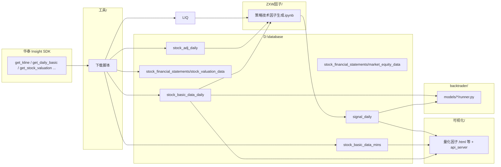

# 项目地图 — `python_venv`（Agent + 人工共用）

> **给谁看：** Cursor Agent 改代码前先读本文；人工想「这个目录是干什么的」也看本文。  
> **数据脚本细节：** 见 [`工具/AGENTS.md`](工具/AGENTS.md)。  
> **回测细节：** 见 [`backtrader/readme.txt`](backtrader/readme.txt)、[`backtrader/MODEL_AUTHORING.md`](backtrader/MODEL_AUTHORING.md)。

---

## 一句话

华泰 Insight 拉行情 → 本地 `D:\database` Parquet → `ZXW因子` 算信号 → `signal_daily` 落盘 → `可视化` 看图/回测 → `backtrader` 跑策略。

---

## 环境

| 项 | 值 |
|----|-----|
| 项目根 | `C:\Users\Administrator\Desktop\python_venv` |
| Python | `.venv\Scripts\python.exe`（优先用这个，不要用系统 Python） |
| 外部数据根 | `D:\database\...`（大文件在盘符 D，不在本仓库） |
| 依赖 | `requirements.txt`（当前仅显式列出 `pypinyin`；实际还用 polars/pandas/duckdb/insight_python 等） |

---

## 数据流（从哪来到哪去）

---

## 目录总览（按重要性）

| 目录 | 作用 | 典型入口 / 备注 |
|------|------|-----------------|
| **`工具/`** | **数据下载、分区合并、DuckDB 检查** | 各 `获得*.py`、`增量信号保存.py`、`各类数据检查.ipynb`；详见 [`工具/AGENTS.md`](工具/AGENTS.md) |
| **`ZXW因子/`** | **技术因子与组合信号计算** | 主 notebook：`ZXW策略技术因子生成.ipynb`；模块如 `MACD因子.py`、`筹码结构因子.py`、`总买入信号_独立全量.py`、`卖出因子_量能.py` |
| **`ZXW因子/自己的抄底逻辑/`** | 实验性抄底逻辑副本 | `洪抄底.py`、`factor_catalog.json`；与主链路并行，改前确认是否仍使用 |
| **`可视化/`** | **前端 K 线 + 因子副图 + HTTP API + 回测任务** | 主入口 `量化因子.html`（四 Tab：量化/形态/舆情/基本面）；`结果展示.html`、`result.html`；组合内嵌 `index.html`；`api_server.py`；`market_data_service.py`；`backtest_job_service.py`；启动：`start_all.bat` |
| **`backtrader/`** | **日线回测引擎与多模型注册** | `settings.py`、`model_registry.py`、`configurable_backtest.py`；模型在 `models/*/` |
| **`backtrader/models/`** | **一模型一子目录** | 网页可跑：`hong_ziming_avg_position`、`zxw_rule_backtest`、`zxw_strong_adjusted_only`、`zxw_init_10pct_snapshot`、`configurable_signal_rules` 等；`zxw_legacy_mac_kdj_bottom` 为内部引擎 |
| **`因子分类/`** | **前端因子分组与说明** | `factor_catalog.json`（分组/树）；`因子说明.md` |
| **`因子解释/`** | **给人看的组合信号说明（HTML）** | 总买入/洪抄底/抄底总分构成等 |
| **`华泰数据获取/`** | **Insight SDK 示例与接口试跑** | `query_demo.py`（各 API demo）；`api_ping_test.py`；非生产下载脚本 |
| **`全市场股票代码/`** | **股票池导出元数据** | `meta.json`（来源、更新时间）；CSV 由 `工具/获得股票日频数据.py` 导出 |
| **`临时脚本存放(系统用)/`** | **一次性说明/临时产出** | 如 `逃顶因子逻辑说明.html`；勿当长期配置 |
| **`temp/`** | **临时文件** | 见 `temp/README.txt`；可删的中间结果 |
| **`.cursor/`** | **Cursor 规则** | `rules/agent-run-everything.mdc`：Agent 默认直接执行 |
| **`.vscode/`** | **编辑器配置** | 非业务逻辑 |

### 历史 / 实验目录（默认不要改，除非用户点名）

| 目录 | 说明 |
|------|------|
| `获得股票数据和 代码(过去用的)/` | 旧版拉数脚本，已被 `工具/` 取代 |
| `尝试复权/` | 复权取数试验 notebook |
| `筹码计算/` | 空目录或占位 |
| `通达信代码/` | 通达信公式/代码文本参考 |
| `Lib/`、`include/`、`venv/` | Python 环境残留；业务代码在 `.venv/` 与项目子目录 |
| `.venv/` | **虚拟环境 site-packages**，不要当项目源码编辑 |
| `__pycache__/` | Python 缓存，可忽略 |

---

## 外部数据 `D:\database`（不在 Git 里）

| 路径 | 写入方 | 内容 |
|------|--------|------|
| `stock_basic_data_daily` | `工具/获得股票日频数据.py` | 日 K OHLCV |
| `stock_financial_statements/market_equity_data` | `工具/获得股票日频换手率.py` | 日 basic（含换手率等）；旧名 `stock_liquidity_data` / `stock_temp_data` 已废弃 |
| `stock_financial_statements/stock_valuation_data` | `工具/获得市值数据.py` | PE/PB/PS/市值等估值 |
| `stock_adj_daily` | `工具/获得股票日频复权因子.py` | 复权因子分段 |
| `stock_basic_data_mins` | `工具/获得股票分钟级数据.py` | 1 分钟 K |
| `index_data_daily` | `工具/获得指数日频数据.py` | 指数日 K |
| `signal_daily` | 因子 notebook + `工具/增量信号保存.py` | 因子信号 `factor=*/year=*/month=*/merged.parquet` |

通用分区：`year=YYYY/month=MM/merged.parquet`，主键语义 **`htsc_code` + `time`**（日频）。

---

## 人工常用操作

| 想做什么 | 怎么做 |
|----------|--------|
| 打开 K 线网页 | `可视化\start_all.bat` → `http://127.0.0.1:8086/量化因子.html`（或单独起 `start_web_server.bat` + `start_api_server.bat`） |
| 更新日 K | `.venv\Scripts\python.exe 工具\获得股票日频数据.py` |
| 更新流动性/换手 | `工具\获得股票日频换手率.py` |
| 更新估值 | `工具\获得市值数据.py` |
| 更新复权因子 | `工具\获得股票日频复权因子.py` |
| 更新分钟线 | `工具\获得股票分钟级数据.py`（默认 `--max-year 2025`） |
| 生成/更新因子 | 运行 `ZXW因子\ZXW策略技术因子生成.ipynb`，再按需 `工具\增量信号保存.py` |
| 检查 parquet | `工具\各类数据检查.ipynb` |
| 试 Insight 接口 | `华泰数据获取\query_demo.py`、`api_ping_test.py` |
| 新增回测模型 | 读 `backtrader/MODEL_AUTHORING.md`，在 `backtrader/models/` 建子目录并注册 |

---

## Agent 任务路由（先选目录再改文件）

| 任务类型 | 去哪个目录 |
|----------|------------|
| 下载/增量/merged 分区/路径改名 | `工具/` → 读 [`工具/AGENTS.md`](工具/AGENTS.md) |
| 单个因子算法、筹码、买卖信号组合 | `ZXW因子/`（大改先看 notebook 如何 import 模块） |
| 前端展示、K 线交互、API、回测按钮 | `可视化/`（`量化因子.html` 等 + `chart_board_core.js` + `api_server.py` + `market_data_service.py`） |
| 回测策略、Optuna、模型列表 | `backtrader/` |
| 前端因子树、分组、文案 | `因子分类/`（`factor_catalog.json` + `因子说明.md`） |
| 信号逻辑说明文档（HTML） | `因子解释/` 或 `临时脚本存放(系统用)/` |
| SDK 字段确认、接口 demo | `华泰数据获取/query_demo.py` |
| 股票池 meta | `全市场股票代码/` |

---

## 关键文件速查

| 文件 | 作用 |
|------|------|
| `可视化/量化因子.html` | **主看板入口**：K 线、因子副图、左拖补历史、自选股、回测面板（加载 `chart_board_core.js` + `board_quant.js`） |
| `可视化/形态面.html` / `舆情面.html` / `基本面.html` | 分视图 Tab；分别加载 `board_morph.js` / `board_sentiment.js` / `board_fundamental.js` |
| `可视化/结果展示.html` | 回测历史列表与删除；侧边悬浮球可跳转 |
| `可视化/result.html` | 组合回测结果外壳；iframe 内嵌 `index.html?embed=1&portfolio=1`（`.YKRS` 组合曲线仅此处） |
| `可视化/index.html` | **非主入口**：仅供 `result.html` 内嵌；直接打开会提示去 `量化因子.html` |
| `可视化/chart_board_core.js` | 看板公共逻辑（K 线、API、布局、自选股）；`BACKTEST_MODEL_FALLBACK` 在此 |
| `可视化/chart_board_backtest.js` | 回测任务 UI、模型列表、参数遍历 |
| `可视化/chart_board_info_core.js` | 舆情/基本面信息区公共逻辑 |
| `可视化/market_data_service.py` | 读 parquet 供 API：bars、因子、代码搜索 |
| `可视化/api_server.py` | HTTP 路由：`/api/market/bars`、因子、回测模型列表等 |
| `可视化/backtest_job_service.py` | 网页触发回测任务 |
| `ZXW因子/ZXW策略技术因子生成.ipynb` | 批量生成技术因子并写入 `signal_daily` |
| `ZXW因子/筹码结构因子.py` | 筹码集中度；读 `market_equity_data` 换手率 |
| `因子分类/factor_catalog.json` | 前端因子分组（与 notebook 产出列名应对齐） |
| `backtrader/model_registry.py` | 回测模型注册表 → 前端 `GET /api/backtest/models` |
| `backtrader/settings.py` | 回测公共路径、资金、DuckDB 视图等 |

---

## Agent 修改约束（全局）

1. **默认 Run Everything**（见 `.cursor/rules/agent-run-everything.mdc`）：能跑命令验证就跑，少反复确认。  
2. **改 `D:\database` 路径** 必须全仓库 `grep` 旧路径（含 notebook 字符串）。  
3. **不要**把 Insight 账号密码提交进 Git；`query_demo.py` / 下载脚本里已有登录逻辑，勿扩散。  
4. **`backtrader` 包路径**：向工程目录 `append` sys.path，勿 `insert(0)` 遮蔽 pip 的 `backtrader`（见 `backtrader/readme.txt`）。  
5. **因子列名** 改动需同步：`factor_catalog.json`、notebook、`market_data_service.py`（若有映射）。  
6. **legacy 目录**（上表「历史/实验」）不要自动迁移或删除，除非用户明确要求。

---

## 子文档索引

| 文档 | 内容 |
|------|------|
| [`工具/AGENTS.md`](工具/AGENTS.md) | 各下载脚本、CLI、分区约定、中文提示词 |
| [`backtrader/readme.txt`](backtrader/readme.txt) | 回测目录结构、模型列表 |
| [`backtrader/MODEL_AUTHORING.md`](backtrader/MODEL_AUTHORING.md) | 新增回测模型流程 |
| [`因子分类/readme.md`](因子分类/readme.md) | catalog 与 Word 说明 |
| [`因子分类/因子说明.md`](因子分类/因子说明.md) | 因子业务说明 |

---

## 可复制提示词（根目录任务）

> 请先阅读仓库根目录 `AGENTS.md`，再读【子目录/文件】。只做最小修改。任务：【描述】。若涉及 `D:\database` 路径，改完后 grep 全仓库并说明如何验证。

> 我要改【前端 K 线 / 左拖历史 / 因子副图】：从 `AGENTS.md` 可视化条目入手，重点看 `可视化/量化因子.html`（或对应 Tab 的 `board_*.js`）、`chart_board_core.js` 与 `market_data_service.py`。

> 我要改【因子生成或信号列名】：从 `ZXW因子/` 与 `因子分类/factor_catalog.json` 一起检查，说明对 `signal_daily` 分区的影响。

> 我要改【回测模型或网页回测入口】：从 `backtrader/model_registry.py` 与 `可视化/api_server.py` 对齐检查。
