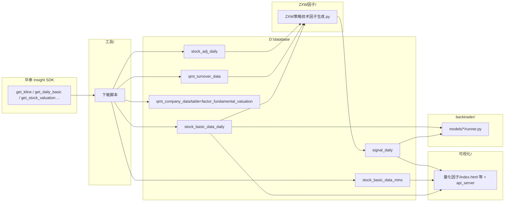

# 项目地图 — `python_venv`（Agent + 人工共用）

> **给谁看：** Cursor Agent 改代码前先读本文；人工想「这个目录是干什么的」也看本文。
> **数据脚本细节：** 见 [`工具/AGENTS.md`](工具/AGENTS.md)。
> **回测细节：** 见 [`backtrader/readme.txt`](backtrader/readme.txt)、[`backtrader/MODEL_AUTHORING.md`](backtrader/MODEL_AUTHORING.md)。

---

## 一句话

华泰 Insight 拉行情 → 本地 `D:\database` Parquet → `ZXW因子` 算信号 → `signal_daily` 落盘 → `可视化` 看图/回测 → `backtrader` 跑策略。

---

## 环境

| 项 | 值 |
|----|-----|
| 项目根 | `C:\Users\Administrator\Desktop\python_venv` |
| Python | `.venv\Scripts\python.exe`（优先用这个，不要用系统 Python） |
| 外部数据根 | `D:\database\...`（大文件在盘符 D，不在本仓库） |
| 依赖 | `requirements.txt`（数据、回测、可视化、Notebook、工具和测试依赖已分组；QMT、TA-Lib、Insight SDK 仍需按本机环境单独安装） |

---

## 数据流（从哪来到哪去）

```mermaid
flowchart LR
  subgraph insight [华泰 Insight SDK]
    API[get_kline / get_daily_basic / get_stock_valuation ...]
  end
  subgraph tools [工具/]
    DL[下载脚本]
  end
  subgraph disk [D:\database]
    OHLC[stock_basic_data_daily]
    LIQ[qmt_turnover_data]
    VAL[qmt_company_data/table=factor_fundamental_valuation]
    ADJ[stock_adj_daily]
    MIN[stock_basic_data_mins]
    SIG[signal_daily]
  end
  subgraph factor [ZXW因子/]
    GEN[ZXW策略技术因子生成.py]
  end
  subgraph ui [可视化/]
    FE[量化因子/index.html 等 + api_server]
  end
  subgraph bt [backtrader/]
    RUN[models/*/runner.py]
  end
  API --> DL --> OHLC & LIQ & VAL & ADJ & MIN
  OHLC & LIQ & ADJ --> GEN --> SIG
  OHLC & MIN & SIG --> FE
  SIG & OHLC --> RUN
```

---

## 目录总览（按重要性）

| 目录 | 作用 | 典型入口 / 备注 |
|------|------|-----------------|
| **`工具/`** | **数据下载、分区合并、DuckDB 检查** | 各 `获得*.py`、`增量信号保存.py`、`各类数据检查.ipynb`；详见 [`工具/AGENTS.md`](工具/AGENTS.md) |
| **`ZXW因子/`** | **技术因子与组合信号计算** | 主入口：`ZXW策略技术因子生成.py`；新增因子先读 [`ZXW因子/AGENTS.md`](ZXW因子/AGENTS.md)，独立实现和验证后再接入主链路 |
| **`可视化/`** | **前端 K 线、市场/板块研究、因子副图、HTTP API、模型有效性与回测任务** | 正式页面位于各自目录的 `index.html`；根部同名 `.html` 多为兼容跳转；详见 [`可视化/README.md`](可视化/README.md) |
| **`backtrader/`** | **日线回测引擎与多模型注册** | `settings.py`、`model_registry.py`、`configurable_backtest.py`；模型在 `models/*/` |
| **`backtrader/models/`** | **一模型一子目录** | 网页注册以 `model_registry.py` 为准；当前包括 `ths_monthly_threshold`、多种 `zxw_factor_check_*`、`zxw_init_10pct_snapshot`、`configurable_signal_rules` |
| **`因子分类/`** | **前端因子分组与说明** | `factor_catalog.json`（分组/树）；`因子说明.md` |
| **`因子解释/`** | **给人看的组合信号说明（HTML）** | 总买入/洪抄底/抄底总分构成等 |
| **`华泰数据获取/`** | **历史导出清单与参考数据** | 当前主要保留指数、ETF、全 A 股票清单 CSV；生产下载脚本在 `工具/` |
| **`全市场股票代码/`** | **股票池导出元数据** | `meta.json`（来源、更新时间）；CSV 由 `工具/获得股票日频数据.py` 导出 |
| **`临时脚本存放(系统用)/`** | **一次性说明/临时产出** | 如 `逃顶因子逻辑说明.html`；勿当长期配置 |
| **`temp/`** | **临时文件** | 见 `temp/README.txt`；可删的中间结果 |
| **`.cursor/`** | **Cursor 规则** | `rules/agent-run-everything.mdc`：Agent 默认直接执行 |
| **`.vscode/`** | **编辑器配置** | 非业务逻辑 |

### 历史 / 实验目录（默认不要改，除非用户点名）

| 目录 | 说明 |
|------|------|
| `获得股票数据和 代码(过去用的)/` | 旧版拉数脚本，已被 `工具/` 取代 |
| `尝试复权/` | 复权取数试验 notebook |
| `筹码计算/` | 空目录或占位 |
| `通达信代码/` | 通达信公式/代码文本参考 |
| `Lib/`、`include/`、`venv/` | Python 环境残留；业务代码在 `.venv/` 与项目子目录 |
| `.venv/` | **虚拟环境 site-packages**，不要当项目源码编辑 |
| `__pycache__/` | Python 缓存，可忽略 |

---

## 外部数据 `D:\database`（不在 Git 里）

| 路径 | 写入方 | 内容 |
|------|--------|------|
| `stock_basic_data_daily` | `工具/获得股票日频数据.py` | 日 K OHLCV |
| `qmt_turnover_data` | `工具/获得股票日频换手率.py` | QMT 日 K + Capital 流通股本计算换手率；换手率主链路 |
| `qmt_company_data/table=factor_fundamental_valuation` | `工具/qmt公司数据获取.py` | PE/PB/PS/市值等估值 |
| `stock_adj_daily` / `stock_adj_daily_raw` | `工具/qmt获得股票日频复权因子.py` | QMT 复权四层数据：raw 原始事件 → segments 分段 → `wide_xdy` 宽表 + `adj_factor_daily` 长表；详见 `工具/AGENTS.md` |
| `stock_basic_data_mins` | `工具/获得股票分钟级数据.py` | 1 分钟 K |
| `index_data_daily` | `工具/获得指数日频数据.py` | 指数日 K |
| `signal_daily` | `ZXW因子/ZXW策略技术因子生成.py` + `工具/增量信号保存.py` | 因子信号 `factor=*/year=*/month=*/merged.parquet` |

通用分区：`year=YYYY/month=MM/merged.parquet`，主键语义 **`htsc_code` + `time`**（日频）。

---

## 人工常用操作

| 想做什么 | 怎么做 |
|----------|--------|
| 打开 K 线网页 | `可视化\start_all.bat` → `http://127.0.0.1:8086/量化因子/index.html`（或单独起 `start_web_server.bat` + `start_api_server.bat`） |
| 更新日 K | `.venv\Scripts\python.exe 工具\获得股票日频数据.py` |
| 更新流动性/换手 | `工具\获得股票日频换手率.py` |
| 更新估值 | `.venv\Scripts\python.exe 工具\qmt公司数据获取.py` |
| 更新复权因子 | `.venv\Scripts\python.exe 工具\qmt获得股票日频复权因子.py` |
| 更新分钟线 | `工具\获得股票分钟级数据.py`（默认 `--max-year 2025`） |
| 生成/更新因子 | 运行 `.venv\Scripts\python.exe ZXW因子\ZXW策略技术因子生成.py`，再按需运行 `工具\增量信号保存.py` |
| 检查 parquet | `工具\各类数据检查.ipynb` |
| 更新同花顺板块/成分 | `.venv\Scripts\python.exe 工具\获得同花顺板块和成分股.py` |
| 新增回测模型 | 读 `backtrader/MODEL_AUTHORING.md`，在 `backtrader/models/` 建子目录并注册 |

---

## Agent 任务路由（先选目录再改文件）

| 任务类型 | 去哪个目录 |
|----------|------------|
| 下载/增量/merged 分区/路径改名 | `工具/` → 读 [`工具/AGENTS.md`](工具/AGENTS.md) |
| 单个因子算法、筹码、买卖信号组合 | `ZXW因子/` → 先读 [`ZXW因子/AGENTS.md`](ZXW因子/AGENTS.md) 与主生成器的 bundle 注册方式 |
| 前端展示、K 线交互、API、回测按钮 | `可视化/`（页面目录 + `shared/` + `api_server.py` + 对应 service） |
| 市场研究集中度 | `可视化/市场研究/` + `market_research_service.py` + `/api/market/research/concentration` |
| 同花顺板块轮动 | `可视化/板块轮动/` + `market_data_service.py` 的指数/成分接口 |
| 风格模型有效性 | `可视化/模型有效性/` + `style_monitor_service.py` + `style_monitor_job_service.py` |
| 回测策略、Optuna、模型列表 | `backtrader/` |
| 前端因子树、分组、文案 | `因子分类/`（`factor_catalog.json` + `因子说明.md`） |
| 信号逻辑说明文档（HTML） | `因子解释/` 或 `临时脚本存放(系统用)/` |
| QMT/Insight 数据下载与字段确认 | `工具/` 对应下载脚本；改前先读 `工具/AGENTS.md` |
| 股票池 meta | `全市场股票代码/` |
| 单个板块深度研究 | **必须先读** [`docs/单板块Codex深度研究运行规范.md`](docs/单板块Codex深度研究运行规范.md)；一个Codex任务只处理一个板块，模型主导检索和语义判断 |

---

## 关键文件速查

| 文件 | 作用 |
|------|------|
| `可视化/量化因子/index.html` | **主看板入口**：K 线、因子副图、左拖补历史、自选股、回测面板 |
| `可视化/形态面/index.html` / `舆情面/index.html` / `基本面/index.html` | 分视图页面；分别加载对应页面逻辑 |
| `可视化/结果展示/index.html` | 回测历史列表与删除；侧边悬浮球可跳转 |
| `可视化/组合结果/index.html` | 组合回测结果外壳；iframe 内嵌组合图表（`.YKRS` 组合曲线仅此处） |
| `可视化/组合图表/index.html` | 组合结果 iframe 使用的图表页，一般不直接作为主入口 |
| `可视化/shared/chart_board_core.js` | 看板公共逻辑（K 线、API、布局、自选股）；`BACKTEST_MODEL_FALLBACK` 在此 |
| `可视化/shared/chart_board_backtest.js` | 回测任务 UI、模型列表、参数遍历 |
| `可视化/shared/chart_board_info_core.js` | 舆情/基本面信息区公共逻辑 |
| `可视化/market_data_service.py` | 读 parquet 供 API：bars、因子、代码搜索 |
| `可视化/api_server.py` | HTTP 路由：`/api/market/bars`、因子、回测模型列表等 |
| `可视化/backtest_job_service.py` | 网页触发回测任务 |
| `ZXW因子/ZXW策略技术因子生成.py` | 批量规划、计算并写入普通及派生因子 |
| `ZXW因子/筹码结构因子.py` | 筹码集中度；只处理 `stock_basic_data_daily` 个股，读 `qmt_turnover_data` 换手率；指数、板块、ETF 不计算 |
| `可视化/市场研究/index.html` | 沪、深、科创、全 A 市场集中度与 RSI 比值 |
| `可视化/板块轮动/index.html` | 同花顺 881/882/885/886 板块收益与成分查看 |
| `可视化/模型有效性/index.html` | 个股风格高低分组合曲线、持仓和交易明细 |
| `因子分类/factor_catalog.json` | 前端因子分组（与生成器产出列名应对齐） |
| `backtrader/model_registry.py` | 回测模型注册表 → 前端 `GET /api/backtest/models` |
| `backtrader/settings.py` | 回测公共路径、资金、DuckDB 视图等 |
| `docs/单板块Codex深度研究运行规范.md` | 单板块独立Codex任务的强制流程、模型/Python职责边界、证据与发布契约 |

---

## Agent 修改约束（全局）

1. **默认 Run Everything**（见 `.cursor/rules/agent-run-everything.mdc`）：能跑命令验证就跑，少反复确认。
2. **改 `D:\database` 路径** 必须全仓库 `rg` 旧路径（含 `.py`、`.ipynb`、前端和文档字符串）。
3. **不要**把 Insight、QMT 或其他数据源的账号密码提交进 Git；下载脚本已有登录逻辑时也不要扩散。
4. **`backtrader` 包路径**：向工程目录 `append` sys.path，勿 `insert(0)` 遮蔽 pip 的 `backtrader`（见 `backtrader/readme.txt`）。
5. **因子列名** 改动需同步：`factor_catalog.json`、`ZXW策略技术因子生成.py`、`market_data_service.py`（若有映射）及相关测试。
6. **legacy 目录**（上表「历史/实验」）不要自动迁移或删除，除非用户明确要求。

---

## 子文档索引

| 文档 | 内容 |
|------|------|
| [`工具/AGENTS.md`](工具/AGENTS.md) | 各下载脚本、CLI、分区约定、中文提示词 |
| [`ZXW因子/AGENTS.md`](ZXW因子/AGENTS.md) | 新因子设计、复权、边界处理、接入与验证契约 |
| [`可视化/README.md`](可视化/README.md) | 页面入口、共享前端、服务层与新增页面维护说明 |
| [`backtrader/readme.txt`](backtrader/readme.txt) | 回测目录结构、模型列表 |
| [`backtrader/MODEL_AUTHORING.md`](backtrader/MODEL_AUTHORING.md) | 新增回测模型流程 |
| [`因子分类/readme.md`](因子分类/readme.md) | catalog 与 Word 说明 |
| [`因子分类/因子说明.md`](因子分类/因子说明.md) | 因子业务说明 |

---

## 可复制提示词（根目录任务）

> 请先阅读仓库根目录 `AGENTS.md`，再读【子目录/文件】。只做最小修改。任务：【描述】。若涉及 `D:\database` 路径，改完后 grep 全仓库并说明如何验证。

> 我要改【前端 K 线 / 左拖历史 / 因子副图】：从 `AGENTS.md` 可视化条目入手，重点看 `可视化/量化因子/index.html`（或对应页面 JS）、`可视化/shared/chart_board_core.js` 与 `可视化/market_data_service.py`。

> 我要新增或修改【因子生成 / 信号列名】：先读 `ZXW因子/AGENTS.md`，独立实现并验证后再接入 `ZXW策略技术因子生成.py`；同步检查 `因子分类/factor_catalog.json`，说明对 `signal_daily` 历史分区和增量预热的影响。

> 我要改【回测模型或网页回测入口】：从 `backtrader/model_registry.py` 与 `可视化/api_server.py` 对齐检查。
